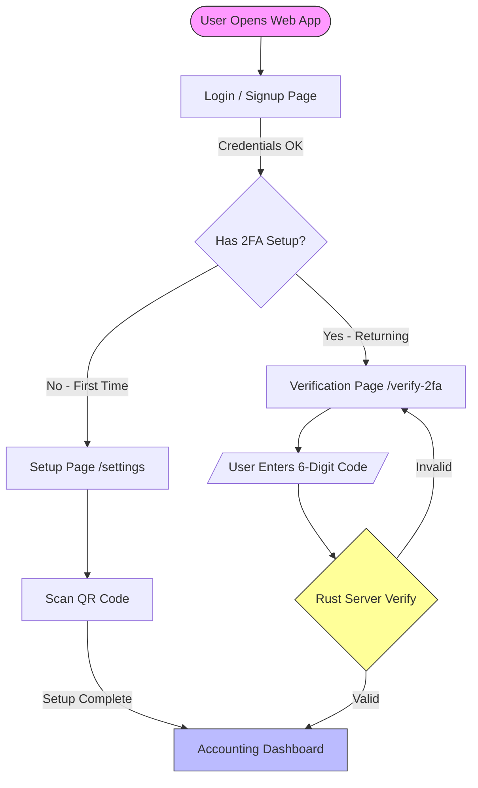

# 🛡️ 2FA Accounting


**A Secure Expense Tracker with Mandatory Two-Factor Authentication.**

> **Live Demo:** [https://2fa-accounting.vercel.app](https://2fa-accounting.vercel.app)  
> _⚠️ Note: The frontend is deployed on Vercel, but the OTP verification relies on a Rust backend. For the full experience (generating/verifying codes), please run the project locally._

## 📖 Introduction

**2FA Accounting** is a web application that combines financial management with enterprise-grade security. This project implements a **Mandatory TOTP (Time-based One-Time Password) Flow** powered by a high-performance **Rust backend**.

This ensures that even if a password is leaked, the account remains secure.

## ✨ Key Features

- **🔐 Mandatory Security Flow**:
  - **New Users**: Forced to scan a QR Code and setup 2FA immediately after signup.
  - **Returning Users**: Forced to verify a 6-digit OTP code every time they log in.
- **Rust Powered**: TOTP generation and verification are handled by a Rust server for speed and safety.
- **Modern Tech Stack**: Built with Next.js 14 (App Router) and TypeScript.
- **UX Optimization**: Auto-formatted OTP input (e.g., `123 456`) designed for readability.

## 🔄 Authentication Workflow

The system intelligently routes users based on their status:



## 📂 Project Structure

```bash
.
├── src/
│   ├── app/
│   │   ├── accounting/    # 💰 Protected Dashboard
│   │   ├── settings/      # ⚙️ 2FA Setup (QR Code)
│   │   ├── verify-2fa/    # 🛡️ OTP Entry Page
│   │   └── page.tsx       # 🏠 Login/Signup Entry
│   ├── components/        # 🧩 Reusable UI Components
│   └── firebase/          # 🔥 Firebase Configuration
├── public/                # 🖼️ Static Assets
├── .env.local             # 🔑 Environment Variables (Git ignored)
└── package.json           # 📦 Dependencies
```
